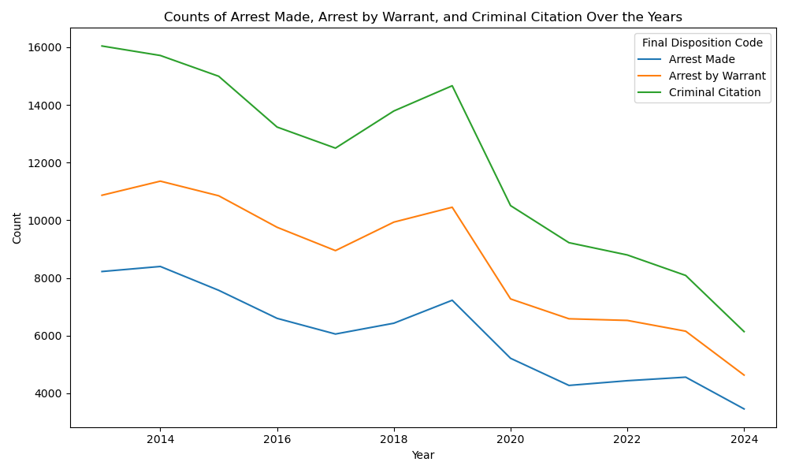

# Predicting Police Call Outcomes: San Jose Police Calls for Service

**Author**: Michael Smith

## Executive Summary
This project aims to predict the outcomes of police calls in San Jose using historical call-for-service data. Various machine learning models are explored to determine whether a call will result in an arrest or citation.

## Rationale
Police departments process thousands of calls for service every day. Being able to predict the outcome of these calls, such as whether an arrest or citation will be issued, can help with resource allocation and operational efficiency.

## Research Question
Can we build a model to predict whether a police call will result in an arrest or citation?

## Data Sources
The data for this project comes from the [San Jose Police Calls For Service dataset](https://data.sanjoseca.gov/dataset/police-calls-for-service), spanning 5 years, from 2018 through 2022.

## Methodology
- **Data Cleaning**: Removed rows with missing data and unnecessary columns.
- **Feature Engineering**: Created features such as `OFFENSE_HOUR`, `OFFENSE_DAY_OF_WEEK`, and encoded categorical features like `CALLTYPE_CODE`.  Added latitude and longitude based on the address, and calculated neighborhood based on those geographical coordinates.
  - Consolidated the final disposition codes into 4 groups:
    - A: Arrest Made
    - B: Arrest by Warrant
    - C: Criminal Citation
    - Other
  - 
    - (Note that 2024 is a partial year)
- **Modeling**: Several machine learning models were applied:
  - Baseline model (predicting the most frequent class)
  - Logistic Regression (LR)
  - Random Forest (RF)
  - XGBoost (XGB)
  - Multi-Layer Perceptron (MLP)
  - Stacking Classifier: An ensemble of Logistic Regression, Random Forest, and XGBoost models.
- **Evaluation Metrics**: Models were evaluated using accuracy, precision, recall, and F1-score. 
  Hyperparameter tuning was performed using Grid Search, or in the case of XGBoost, hyperparameters were tuned using [Optuna](https://optuna.org/).

## Results

Below are the test results for models trained on the dataset that included calls from 2013 through 9/9/2024.

| Model              | Accuracy  | Recall (macro) | Precision (macro) | F1-score (macro)  |
|--------------------|-----------|----------:|----------:|----------:|
| Baseline | 0.959557 | 0.250000 | 0.239889 | 0.244840 |
| Logistic Regression | 0.967962 | 0.517144 | 0.715816 | 0.570390 |
| Random Forest | 0.966839 | 0.549022 | 0.672930 | 0.597342 |
| MLP | 0.968534 | 0.525174 | 0.726581 | 0.586147 |
| XGBoost | 0.969643 | 0.560165 | 0.721776 | 0.617340 |
| Stacking Ensemble |	0.969968 | 0.571520 | 0.721708 | 0.627692 |

### Model Performance

The table above shows the test results for various models trained on police call data spanning from 2013 to September 2024. The models are evaluated on multiple performance metrics, including accuracy, recall, precision, and F1-score (all using macro averaging). 

- **Baseline Model**: The baseline model, which predicts the most frequent class, shows a high accuracy of 95.96%. However, its F1-score is quite low (0.2448), reflecting poor performance across the less frequent classes.
  
- **Logistic Regression**: The logistic regression model achieves a balanced performance with a 96.80% accuracy and an F1-score of 0.5704, significantly improving over the baseline. This model demonstrates strong precision (0.7158), indicating better handling of class distribution.

- **Random Forest**: Random forest performs slightly better than logistic regression, achieving a 96.68% accuracy and improving recall to 0.5490. The model offers a better F1-score (0.5973), indicating an enhanced balance between precision and recall.

- **Multilayer Perceptron (MLP)**: The MLP model shows competitive results with an accuracy of 96.85% and an F1-score of 0.5861. It demonstrates the ability to generalize well, with strong precision (0.7266), performing better than logistic regression and random forest on some metrics.

- **XGBoost**: XGBoost outperforms the previous models with an accuracy of 96.96% and an F1-score of 0.6173, demonstrating the highest recall (0.5602) and consistently high precision (0.7218). This indicates its strength in handling the imbalanced nature of the dataset.

- **Stacking Ensemble**: The stacking ensemble, combining logistic regression, random forest, and XGBoost, delivers the best overall performance. It achieves an accuracy of 96.99%, with a macro F1-score of 0.6277. This suggests that leveraging multiple models helps improve the model's ability to generalize across different call outcomes, offering the best balance of precision (0.7217) and recall (0.5715).

These results indicate that ensemble techniques such as stacking can provide superior performance for complex and imbalanced datasets by combining the strengths of multiple models.

## Next Steps
- Investigate ways to address class imbalance using techniques like SMOTE or adjusting class weights.
- Consider feature selection to reduce dimensionality and improve model performance.

## Outline of Project
- [jupyter notebook with models trained on 2013-2024 data](all_years_data.ipynb)
- [2013](2013.ipynb)
- [2014](2014.ipynb)
- [2015](2015.ipynb)
- [2016](2016.ipynb)
- [2017](2017.ipynb)
- [2018](2018.ipynb)
- [2019](2019.ipynb)
- [2020](2020.ipynb)
- [2021](2021.ipynb)
- [2022](2022.ipynb)
- [2023](2023.ipynb)
- [2024](2024.ipynb)

