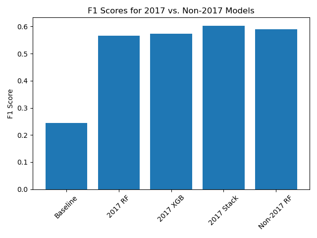
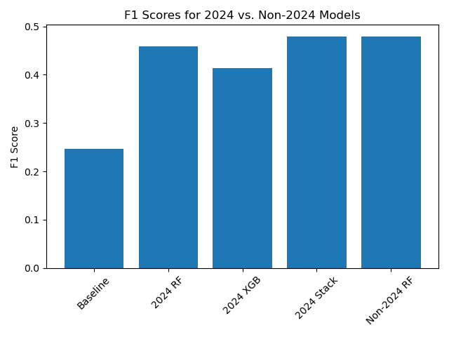
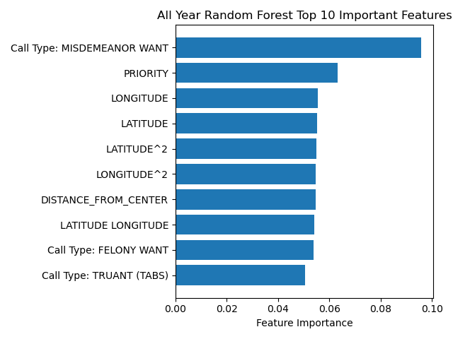

# Predicting Police Call Outcomes: San Jose Police Calls for Service

**Author**: Michael Smith

## Executive Summary
This project aims to predict the outcomes of police calls in San Jose using historical call-for-service data. By leveraging various machine learning models, the project seeks to determine whether a call will result in an arrest or citation. Accurate predictions of these outcomes can provide critical insights into police operations, leading to more effective resource allocation and improved operational efficiency.

## Rationale
Police departments handle thousands of calls for service daily, with each call requiring different levels of attention, resources, and response times. Predicting the outcome of these calls—such as whether an arrest or citation will be issued—can play a crucial role in streamlining police operations. For instance, by knowing in advance which calls are likely to require significant resources (e.g., an arrest), departments can better allocate officers, reduce response times, and improve public safety outcomes.

Additionally, this predictive capability could help identify high-risk situations, enabling police departments to proactively manage them by deploying specialized units or additional resources. Furthermore, understanding patterns in police call outcomes can contribute to broader strategic planning, such as identifying neighborhoods or time periods that tend to result in higher arrest or citation rates, allowing departments to optimize patrols and enhance their presence in key areas.

## Research Questions
1. Can we build a model to predict whether a police call will result in an arrest or citation?
2. Does a model trained on multiple years of data perform better at predicting outcomes for a particular year than a model trained only on data from that year?

## Data Sources
The data for this project comes from the [San Jose Police Calls For Service dataset](https://data.sanjoseca.gov/dataset/police-calls-for-service), spanning multiple years from 2013 through September 2024.

## Methodology
- **Data Cleaning**: Removed rows with missing data and unnecessary columns.
- **Feature Engineering**: Created features such as `OFFENSE_HOUR`, `OFFENSE_DAY_OF_WEEK`, and encoded categorical features like `CALLTYPE_CODE`.  Added latitude and longitude based on the address, and calculated neighborhood based on those geographical coordinates.
  - Consolidated the final disposition codes into 4 groups:
    - A: Arrest Made
    - B: Arrest by Warrant
    - C: Criminal Citation
    - Other
  - 
    - (Note that 2024 is a partial year)
- **Modeling**: Several machine learning models were applied:
  - Baseline model (predicting the most frequent class)
  - Logistic Regression (LR)
  - Random Forest (RF)
  - XGBoost (XGB)
  - Multi-Layer Perceptron (MLP)
  - Stacking Classifier: An ensemble of Logistic Regression, Random Forest, and XGBoost models.
- **Evaluation Metrics**: Models were evaluated using accuracy, precision, recall, and F1-score. 
  Hyperparameter tuning was performed using Grid Search, or in the case of XGBoost, hyperparameters were tuned using [Optuna](https://optuna.org/).

## Focus on F1 Score
For this project, I chose to focus on the F1 score as the primary evaluation metric rather than accuracy. The main reason for this decision is the class imbalance present in the dataset, as seen in the below chart. Most of the police call outcomes fall into one predominant category (Other), with only a small fraction of calls resulting in outcomes of arrests or citations. This imbalance can cause accuracy to be misleading, as a model could achieve high accuracy simply by predicting the majority class most of the time without effectively identifying the minority classes.

The F1 score, which is the harmonic mean of precision and recall, provides a more balanced view of the model's performance on all classes, especially when class distribution is skewed. By focusing on both precision (how many of the predicted positive cases are actually correct) and recall (how many of the actual positive cases are correctly identified), the F1 score captures how well the model handles the minority classes.

This is particularly important in this context because correctly identifying critical outcomes like arrests or citations is more valuable than merely achieving high overall accuracy. A model with a high F1 score is better at handling the trade-off between precision and recall, making it more suitable for applications where both false positives and false negatives have significant consequences.

## Results

### Model Performance

The table below summarizes the performance of several models trained on police call data spanning 2013 through September 9, 2024. The performance is evaluated using Accuracy, Recall, Precision, and F1-score (all macro-averaged to handle the class imbalance).

| Model            | Accuracy	 | Recall (macro)	| Precision (macro) |	F1-score (macro) |
|------------------|----------:|---------------:|------------------:|-----------------:|
| Baseline	       | 0.959557  |	0.250000      |	0.239889	        | 0.244840         |
| Logistic Regression	| 0.967887 |	0.515198 |	0.714711 |	0.567930 |
| Random Forest |	0.966305 | 0.529287 |	0.671339 |	0.582632 |
| MLP |	0.969496 | 0.561787 |	0.717570 |	0.616627 |
| XGB |	0.969426 | 0.556121 |	0.717570 |	0.612663 |
| Ensemble |	0.969548 | 0.563611 |	0.716107 |	0.618922 |

#### Key Observations

- **Baseline Performance**: The baseline model, which predicts the most frequent class, achieves a high accuracy of 95.96%. However, this is misleading due to the heavily imbalanced nature of the dataset. The low recall (0.25) and F1-score (0.24) confirm the model's inability to identify minority classes effectively.

- **Logistic Regression**: Logistic regression shows a significant improvement over the baseline, particularly in recall (0.52) and F1-score (0.57). This improvement reflects the model's ability to capture more minority class instances, although the precision is higher than recall, indicating it predicts minority classes with higher confidence but misses some.

- **Random Forest**: The random forest model further improves recall to 0.53, with a corresponding F1-score of 0.58. This suggests that it is more effective at capturing the diversity of the classes compared to logistic regression.

- **Multilayer Perceptron (MLP)**: MLP delivers the best F1-score (0.62) among the individual models, showing balanced performance in recall and precision. This model appears to handle class imbalance better than traditional models, achieving strong generalization.

- **XGBoost**: XGBoost also performs well, achieving a similar F1-score (0.61) to the MLP, with balanced recall and precision. This shows its capability to handle imbalanced datasets with complex decision boundaries.

- **Ensemble Model**: The ensemble of models (Logistic Regression, Random Forest, and XGBoost) achieves the best F1-score (0.62), leveraging the strengths of each model. The slight improvement over the individual models suggests that ensemble learning can provide a more robust solution by combining different classifiers.

#### Conclusion

All models outperform the baseline significantly in recall and F1-score, highlighting their ability to handle the class imbalance better. The ensemble model demonstrates that combining models can yield incremental gains, especially in F1-score, which is critical for this dataset. The MLP and XGBoost models also show strong individual performance, making them reliable choices for this task.

### Individual Years

In addition to training models on the full dataset, I also trained and tested the same types of models on one year of data at a time for each year from 2013 to 2024. The goal was to see how the predictive performance changes over the years and to determine whether models trained on the entire dataset (2013-2024) outperform models trained on a single year's worth of data when predicting outcomes for that particular year.

Below are charts for two example years, 2017 and 2024, showing the F1 scores for models trained on just that year's data versus a random forest model trained on all the other years in the dataset:

**2017 F1 Scores**  
In 2017, the random forest and XGBoost models trained on that year's data performed similarly well, with F1 scores around 0.55. The stacking model achieved the highest F1 score, slightly above 0.58, indicating that combining multiple models provided better predictive power. Interestingly, the random forest model trained on data from all the other years (2013-2024 excluding 2017) performed comparably well, suggesting that general trends in police call outcomes remained relatively consistent across the years.

**2024 F1 Scores**  
For 2024, the trends were similar, with the stacking model once again achieving the highest F1 score of around 0.48. Both the random forest and XGBoost models trained on 2024 data performed well, though slightly lower than in 2017, suggesting that the models may have faced more difficulty with the most recent year's data. As with 2017, the random forest model trained on all other years also performed similarly, demonstrating that data from earlier years can still provide valuable insights for predicting outcomes in more recent years.

### Feature Importance and Actionable Insights

The random forest model highlights the most important features for predicting police call outcomes, such as the likelihood of an arrest. Below are the top 10 most important features, as determined by the model, and how they translate into actionable insights for operational decision-making:

**Feature Importance Chart:**

**Key Features and Recommendations:**

1. **Call Type: MISDEMEANOR WANT**  
   This call type is the most important predictor of police call outcomes. Misdemeanor warrants often lead to arrests or citations.  
   **Recommendation**: Allocate more police resources, such as officers specializing in warrant handling or community policing, to areas where misdemeanor warrants are frequently called. Prioritizing these calls can improve efficiency by reducing time spent on low-priority incidents.

2. **PRIORITY**  
   Calls classified with a higher priority are more likely to result in significant outcomes like arrests.  
   **Recommendation**: Prioritize officer dispatch to high-priority calls based on the model’s predictions. Implementing a **dynamic dispatch system** could ensure that more officers are available in real-time for these high-priority situations, reducing response times and improving arrest rates.

3. **Geographic Features (LONGITUDE, LATITUDE, and their interactions)**  
   Location is a strong predictor of outcomes, suggesting certain areas are hotspots for particular types of police activity (e.g., arrests, citations).  
   **Recommendation**: Use **geospatial analysis** to identify crime hotspots. Police patrols and resources (e.g., specialized units or equipment) should be concentrated in these areas during peak hours to pre-emptively manage potential incidents.

4. **DISTANCE_FROM_CENTER**  
   Calls that are farther from the central location (e.g., police station) may require different handling due to response time or call complexity.  
   **Recommendation**: Establish **satellite police stations** or deploy mobile units in distant areas to reduce response times for high-impact calls. This could enhance resource efficiency, particularly for priority calls that occur far from main stations.

5. **Call Type: FELONY WANT**  
   Felony warrants are strongly associated with arrests, as the law often mandates an arrest in such cases.  
   **Recommendation**: Ensure that officers trained in handling felony arrests are dispatched to these calls. Additionally, special **felony task forces** could be implemented in areas with high felony warrant activity to expedite handling these situations.

6. **Call Type: TRUANT (TABS)**  
   Truancy calls are often lower in priority, but their occurrence could indicate broader social or community issues, such as a need for interventions in youth-related crimes.  
   **Recommendation**: Work with community organizations to address underlying issues that lead to high truancy rates. Officers can collaborate with schools and social services to provide targeted community outreach, which may help reduce future incidents that lead to police involvement.

**General Actionable Insights**:
- **Resource Optimization**: By understanding which call types are most predictive of arrests (like `MISDEMEANOR WANT` and `FELONY WANT`), police departments can allocate officers more effectively. Specialized response teams could be assigned to handle specific call types, optimizing the use of manpower and equipment.
  
- **Geospatial Deployment**: The model highlights the importance of geographic features, meaning that certain areas are more prone to serious outcomes. Deploying more officers or specialized teams in these regions during peak hours could help prevent crime and reduce response times.

- **Strategic Planning**: The feature `PRIORITY` suggests that high-priority calls often result in more critical outcomes. By integrating predictive models into a **call triage system**, dispatchers can allocate resources more efficiently, ensuring that officers are deployed to the most important calls first.

## Next Steps
- Investigate ways to address class imbalance using techniques like SMOTE or adjusting class weights.
- Consider feature selection to reduce dimensionality and improve model performance.

## Outline of Project
- [Jupyter notebook with models trained on 2013-2024 data](all_years_data.ipynb)
- Notebooks for individual years
  - [2013](2013.ipynb)
  - [2014](2014.ipynb)
  - [2015](2015.ipynb)
  - [2016](2016.ipynb)
  - [2017](2017.ipynb)
  - [2018](2018.ipynb)
  - [2019](2019.ipynb)
  - [2020](2020.ipynb)
  - [2021](2021.ipynb)
  - [2022](2022.ipynb)
  - [2023](2023.ipynb)
  - [2024](2024.ipynb)

