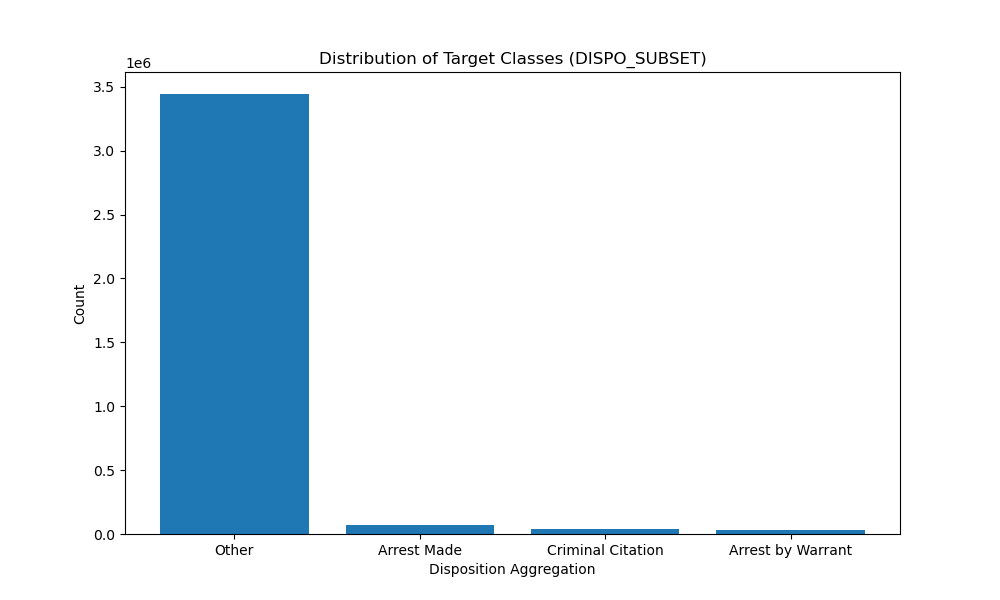

# Predicting Police Call Outcomes: San Jose Police Calls for Service

**Author**: Michael Smith

## Executive Summary
This project aims to predict the outcomes of police calls in San Jose using historical call-for-service data. By leveraging various machine learning models, the project seeks to determine whether a call will result in an arrest or citation. Accurate predictions of these outcomes can provide critical insights into police operations, leading to more effective resource allocation and improved operational efficiency.

## Rationale
Police departments handle thousands of calls for service daily, with each call requiring different levels of attention, resources, and response times. Predicting the outcome of these calls—such as whether an arrest or citation will be issued—can play a crucial role in streamlining police operations. For instance, by knowing in advance which calls are likely to require significant resources (e.g., an arrest), departments can better allocate officers, reduce response times, and improve public safety outcomes.

Additionally, this predictive capability could help identify high-risk situations, enabling police departments to proactively manage them by deploying specialized units or additional resources. Furthermore, understanding patterns in police call outcomes can contribute to broader strategic planning, such as identifying neighborhoods or time periods that tend to result in higher arrest or citation rates, allowing departments to optimize patrols and enhance their presence in key areas.

## Research Questions
1. Can we build a model to predict whether a police call will result in an arrest or citation?
2. Does a model trained on multiple years of data perform better at predicting outcomes for a particular year than a model trained only on data from that year?

## Data Sources
The data for this project comes from the [San Jose Police Calls For Service dataset](https://data.sanjoseca.gov/dataset/police-calls-for-service), spanning multiple years from 2013 through September 2024.

## Methodology
- **Data Cleaning**: Removed rows with missing data and unnecessary columns.
- **Feature Engineering**: Created features such as `OFFENSE_HOUR`, `OFFENSE_DAY_OF_WEEK`, and encoded categorical features like `CALLTYPE_CODE`.  Added latitude and longitude based on the address, and calculated neighborhood based on those geographical coordinates.
  - Consolidated the final disposition codes into 4 groups:
    - A: Arrest Made
    - B: Arrest by Warrant
    - C: Criminal Citation
    - Other
  - 
    - (Note that 2024 is a partial year)
- **Modeling**: Several machine learning models were applied:
  - Baseline model (predicting the most frequent class)
  - Logistic Regression (LR)
  - Random Forest (RF)
  - XGBoost (XGB)
  - Multi-Layer Perceptron (MLP)
  - Stacking Classifier: An ensemble of Logistic Regression, Random Forest, and XGBoost models.
- **Evaluation Metrics**: Models were evaluated using accuracy, precision, recall, and F1-score. 
  Hyperparameter tuning was performed using Grid Search, or in the case of XGBoost, hyperparameters were tuned using [Optuna](https://optuna.org/).

## Focus on F1 Score
For this project, I chose to focus on the F1 score as the primary evaluation metric rather than accuracy. The main reason for this decision is the class imbalance present in the dataset, as seen in the below chart. Most of the police call outcomes fall into one predominant category (Other), with only a small fraction of calls resulting in outcomes of arrests or citations. This imbalance can cause accuracy to be misleading, as a model could achieve high accuracy simply by predicting the majority class most of the time without effectively identifying the minority classes.

The F1 score, which is the harmonic mean of precision and recall, provides a more balanced view of the model's performance on all classes, especially when class distribution is skewed. By focusing on both precision (how many of the predicted positive cases are actually correct) and recall (how many of the actual positive cases are correctly identified), the F1 score captures how well the model handles the minority classes.

This is particularly important in this context because correctly identifying critical outcomes like arrests or citations is more valuable than merely achieving high overall accuracy. A model with a high F1 score is better at handling the trade-off between precision and recall, making it more suitable for applications where both false positives and false negatives have significant consequences.

## Results

### Model Performance

The table below summarizes the performance of several models trained on police call data spanning 2013 through September 9, 2024. The performance is evaluated using Accuracy, Recall, Precision, and F1-score (all macro-averaged to handle the class imbalance).

| Model            | Accuracy	 | Recall (macro)	| Precision (macro) |	F1-score (macro) |
|------------------|-----------|----------------|-------------------|------------------|
| Baseline	       | 0.959557  |	0.250000      |	0.239889	        | 0.244840         |
| Logistic Regression	| 0.967887 |	0.515198 |	0.714711 |	0.567930 |
| Random Forest |	0.966305 | 0.529287 |	0.671339 |	0.582632 |
| MLP |	0.969496 | 0.561787 |	0.717570 |	0.616627 |
| XGB |	0.969426 | 0.556121 |	0.717570 |	0.612663 |
| Ensemble |	0.969548 | 0.563611 |	0.716107 |	0.618922 |

#### Key Observations

- **Baseline Performance**: The baseline model, which predicts the most frequent class, achieves a high accuracy of 95.96%. However, this is misleading due to the heavily imbalanced nature of the dataset. The low recall (0.25) and F1-score (0.24) confirm the model's inability to identify minority classes effectively.

- **Logistic Regression**: Logistic regression shows a significant improvement over the baseline, particularly in recall (0.52) and F1-score (0.57). This improvement reflects the model's ability to capture more minority class instances, although the precision is higher than recall, indicating it predicts minority classes with higher confidence but misses some.

- **Random Forest**: The random forest model further improves recall to 0.53, with a corresponding F1-score of 0.58. This suggests that it is more effective at capturing the diversity of the classes compared to logistic regression.

- **Multilayer Perceptron (MLP)**: MLP delivers the best F1-score (0.62) among the individual models, showing balanced performance in recall and precision. This model appears to handle class imbalance better than traditional models, achieving strong generalization.

- **XGBoost**: XGBoost also performs well, achieving a similar F1-score (0.61) to the MLP, with balanced recall and precision. This shows its capability to handle imbalanced datasets with complex decision boundaries.

- **Ensemble Model**: The ensemble of models (Logistic Regression, Random Forest, MLP, and XGBoost) achieves the best F1-score (0.62), leveraging the strengths of each model. The slight improvement over the individual models suggests that ensemble learning can provide a more robust solution by combining different classifiers.

#### Conclusion

All models outperform the baseline significantly in recall and F1-score, highlighting their ability to handle the class imbalance better. The ensemble model demonstrates that combining models can yield incremental gains, especially in F1-score, which is critical for this dataset. The MLP and XGBoost models also show strong individual performance, making them reliable choices for this task.

### Individual Years

In addition to training models on the full dataset, I also trained and tested the same types of models on one year of data at a time for each year from 2013 to 2024. The goal was to see how the predictive performance changes over the years and to determine whether models trained on the entire dataset (2013-2024) outperform models trained on a single year's worth of data when predicting outcomes for that particular year.

Below are charts for two example years, 2017 and 2024, showing the F1 scores for models trained on just that year's data versus those trained on the entire dataset:

**2017 F1 Scores**  

**2024 F1 Scores**  

Contrary to my initial expectations, the models trained on the full dataset did not consistently outperform the models trained on individual years across the board. In many cases, the performance of models trained on one year of data was comparable to, or even better than, the models trained on all years of data. 

However, **Random Forest** stands out as an exception. The random forest model trained on the full dataset consistently outperformed the models trained on individual years when tested on the respective year’s data. This suggests that, for certain model types, training on a larger, more diverse dataset spanning multiple years can yield more generalizable results. 

The results indicate that while leveraging data from multiple years can sometimes improve performance, this approach may not always lead to better results for all models or all years. It highlights the complexity of the dataset and the challenges of building a model that generalizes well across different time periods.

## Next Steps
- Investigate ways to address class imbalance using techniques like SMOTE or adjusting class weights.
- Consider feature selection to reduce dimensionality and improve model performance.

## Outline of Project
- [Jupyter notebook with models trained on 2013-2024 data](all_years_data.ipynb)
- Notebooks for individual years
  - [2013](2013.ipynb)
  - [2014](2014.ipynb)
  - [2015](2015.ipynb)
  - [2016](2016.ipynb)
  - [2017](2017.ipynb)
  - [2018](2018.ipynb)
  - [2019](2019.ipynb)
  - [2020](2020.ipynb)
  - [2021](2021.ipynb)
  - [2022](2022.ipynb)
  - [2023](2023.ipynb)
  - [2024](2024.ipynb)

